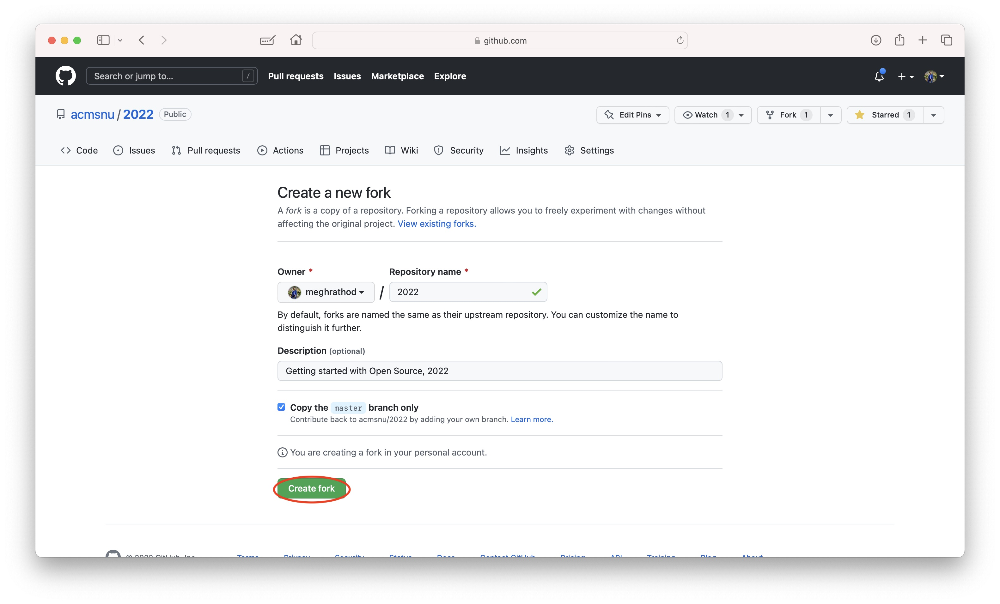
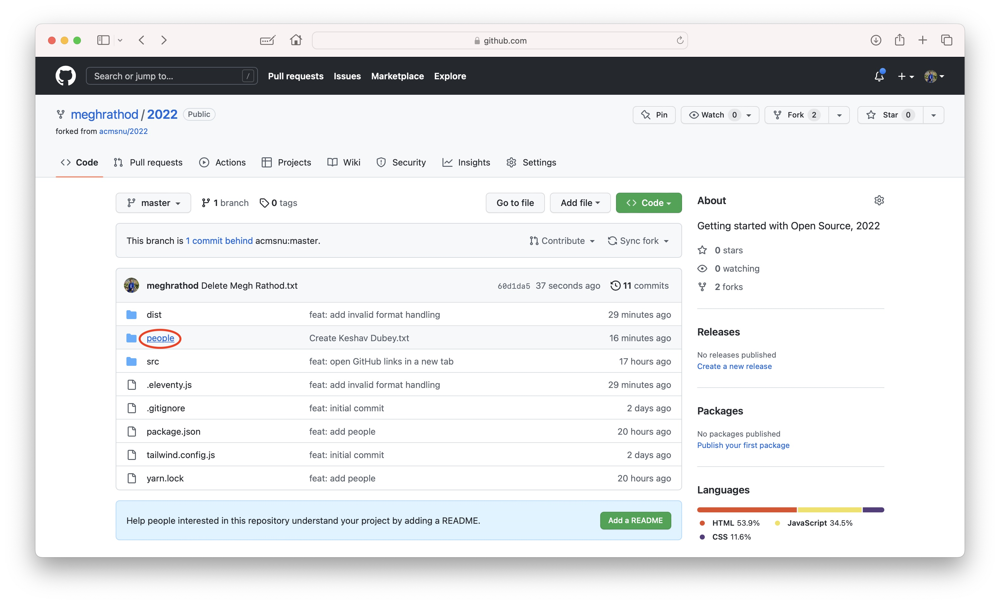
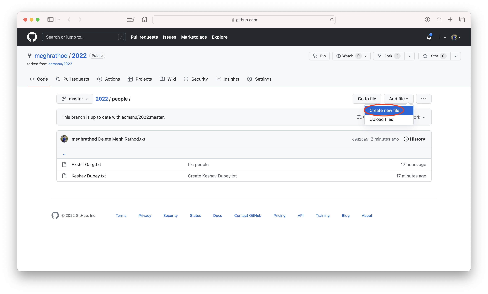
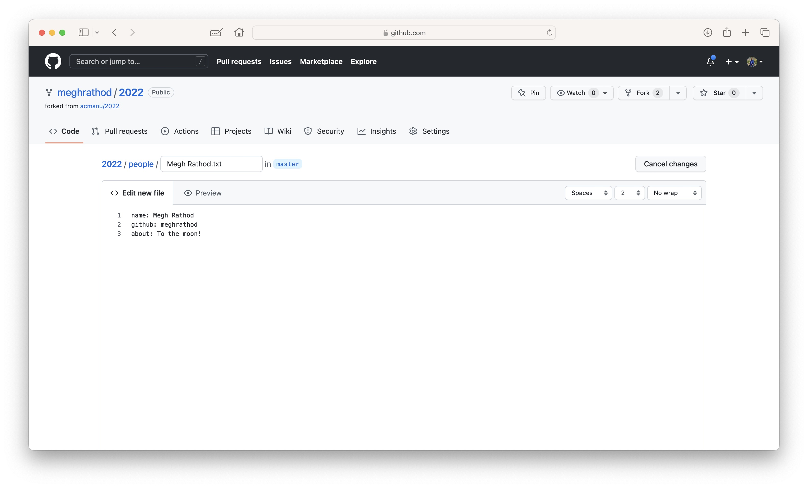
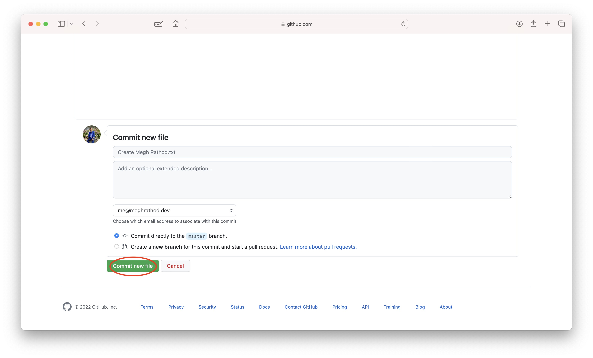
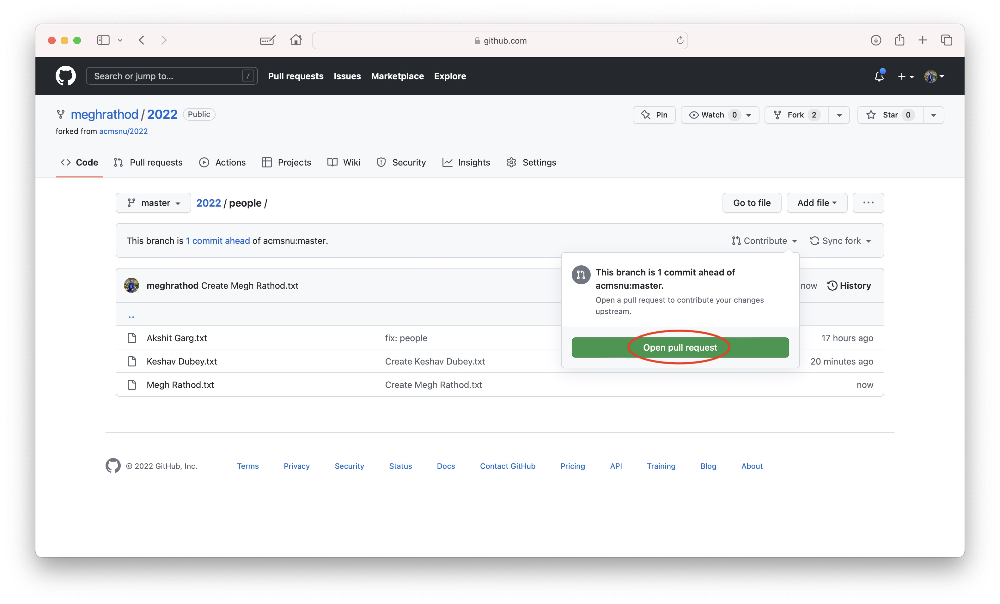
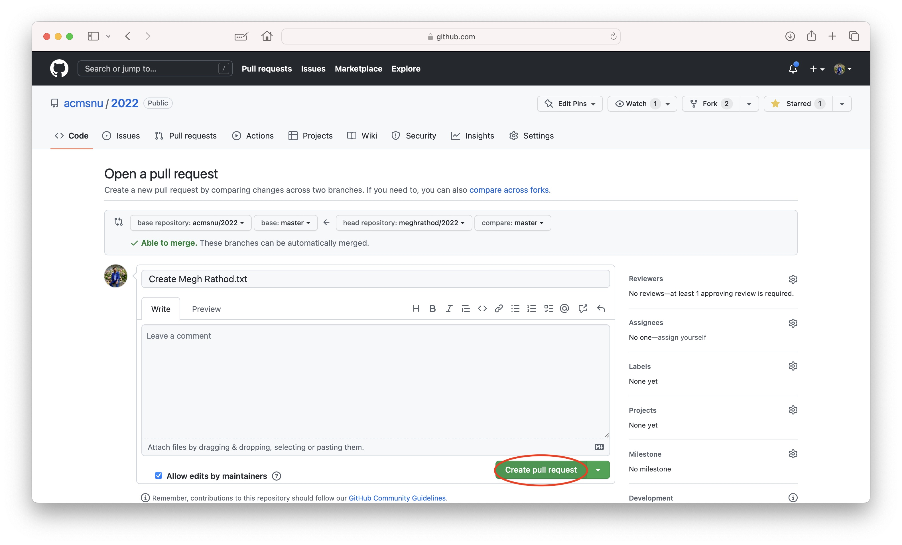
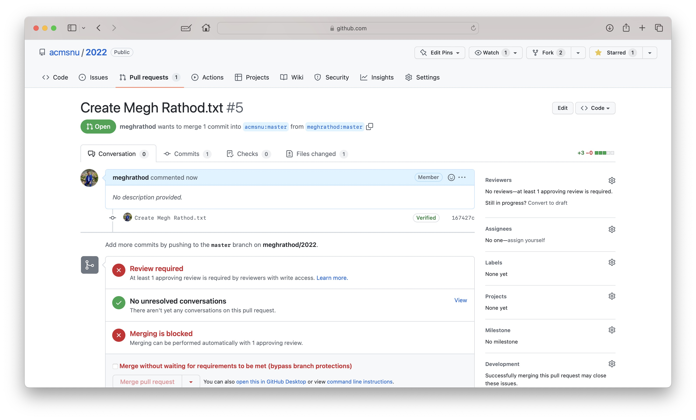

# Getting Started with Open Source Development

> This excercise will give you a flavour of what it's like to contribute to an open source project. You'll be creating a pull request to add your name and fun catch phrase to our website. You'll get to see how your changes get reviewed and merged. If you're having trouble, feel free to ask for help.

## Step 0: Creating a GitHub account

- If you don't already have one, create a GitHub account [here](https://github.com/signup)

## Step 1: Fork the repository

- Go to the [repository](https://github.com/acmsnu/2022) and click the "Fork" button in the top right corner.
- Add a repository name and click "Create Fork".


- If you want you can change the name of the fork and then click "Create Fork".
> This will create a fork of the repository in your account. Fork is a copy of a repository. It allows you to freely experiment with changes without affecting the original project. You can read more about it [here](https://docs.github.com/en/get-started/quickstart/fork-a-repo).



## Step 2: Navigating to the people folder and create a new file

- Navigate to the `people` folder and click on the "Add File" button.




## Step 3: Adding content to the new 

> Content can be added in two ways. You can either use the editor or upload a file. We'll be using the editor for this excercise. We can even you our local machine to clone 

- Create a file with the name `<your-name>.txt` and add the following content to it.

```txt
name: <your-name>
github: <your-github-username>
about: <your-fun-catch-phrase>
```

- It should look something like this.



- Once you're done, click on the "Commit new file" button. 

> You may add a commit message if you want. Learn more about conventional commit messages [here](https://www.conventionalcommits.org/en/v1.0.0/).



Step 4: Creating a pull request

- Click on the contribute button and then click on the "Open pull request" button.



- Add a title and description to the pull request(optional) and click on the "Create pull request" button.



- You will be redirected to the pull request page. You can see the changes you made and the status of the pull request.

> Don't worry if you see a red cross. It means that the pull request is not ready to be merged. A reviewer will review your pull request and let you know if there are any changes that need to be made.



- You're done! You've successfully created a pull request. You can now wait for your pull request to be reviewed and merged by one of ACM's team members.

## Congratulations! You have successfully created your first pull request!